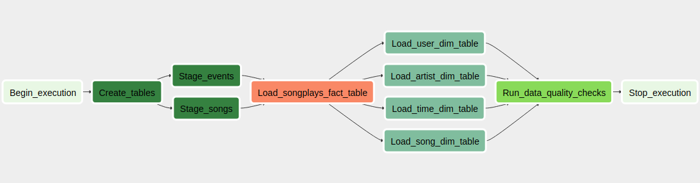

# Sparkify Cloud Data Warehouse with Airflow

A music streaming company, Sparkify, has decided that it is time to introduce more automation and monitoring to their data warehouse ETL pipelines with Apache Airflow. Their data resides in Amazon S3, in a directory of JSON logs on user activity on the app, as well as a directory with JSON metadata on the songs in their app and needs to be processed in Sparkify's data warehouse in Amazon Redshift.

We will take the role to build data pipelines that are dynamic and built from reusable tasks, can be monitored, and allow easy backfills. To achieve our project's goals, we will need to create custom operators to perform tasks such as staging the data, filling the data warehouse, and running checks on the data as the final step.

## Datasets

- **Song data**: json metadata on the songs in Sparkify app, located at *`s3://udacity-dend/song_data`*
- **Log data**: json logs on user activity on Sparkify app, located at *`s3://udacity-dend/log_data`*

## Database schema

- We use a star schema optimized for queries on song play analysis, which is defined in `create_tables.sql` file.  
This includes one fact table - `songplays` referencing four dimension tables - `users, songs, artists, time`.

### Fact table

1. **songplays** - records in log data associated with song plays i.e. records with page `NextSong`  
    - columns: *playid, start_time, userid, "level", songid, artistid, sessionid, location, user_agent*

### Dimension tables

2. **users** - users in the app  
    - columns: *userid, first_name, last_name, gender, "level"*
3. **songs** - songs in music database  
    - columns: *songid, title, artistid, "year", duration*
4. **artists** - artists in music database
    - columns: *artistid, name, location, latitude, longitude*
5. **time** - timestamps of records in songplays broken down into specific units
    - columns: *start_time, "hour", "day", week, "month", "year", weekday*

## Data pipelines with Airflow

### Directed Acyclic Graph (DAG)

The workflow of the data pipelines is defined in `dags/sparkify_etl_dag.py`. Bellow is graph view image of the DAG:

### Operators
There are five operators in the data pipelines that will create tables, stage the data, transform the data, and run checks on data quality. These operators are defined in `plugins/operators`.

#### CreateTableOperator
This operator is used to create tables in Amazon Redshift and their database schema is defined in `create_tables.sql` file.

#### StageToRedshiftOperator
The stage operator is expected to be able to load any JSON formatted files from S3 to Amazon Redshift. The operator creates and runs a SQL COPY statement with the parameters provided.

#### LoadFactOperator and LoadDimensionOperator
Dimension and fact operators utilize the provided SQL helper class to run data transformations and the results will be loaded into target tables in Amazon Redshift.
Dimension loads are often done with the truncate-insert pattern where the target table is emptied before the load. Thus, you could also have a parameter that allows switching between insert modes when loading dimensions. Fact tables are usually so massive that they should only allow append type functionality.

#### DataQualityOperator
The final operator to create is the data quality operator, which is used to run checks on the data itself. The operator's main functionality is to receive one or more SQL based test cases along with the expected results and execute the tests. For each the test, the test result and expected result needs to be checked and if there is no match, the operator should raise an exception and the task should retry and fail eventually.
